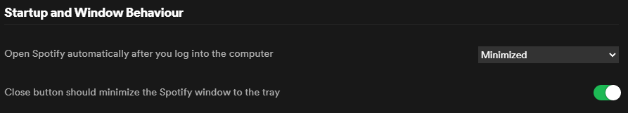

# Spotify Closer
A small script to get around the annoying autostart behavior of Spotify!

# Install
## Spotify Settings
Please set your Spotify settings as shown (unser advanced settings):

## Script Install
To Install this script just clone this repo, run the installer script and follow the instructions.
The script will be located at %appdata%\Microsoft\Windows\Start Menu\Programs\Paidn\spotify_closer.bat

You can customize the timeout for spotify to launch to meet your requirements.
